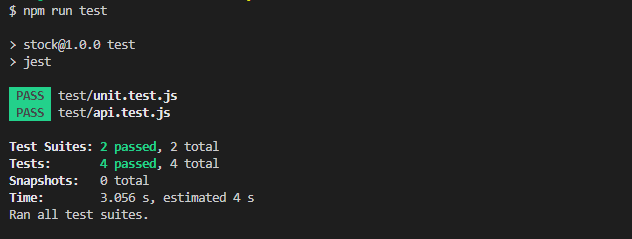
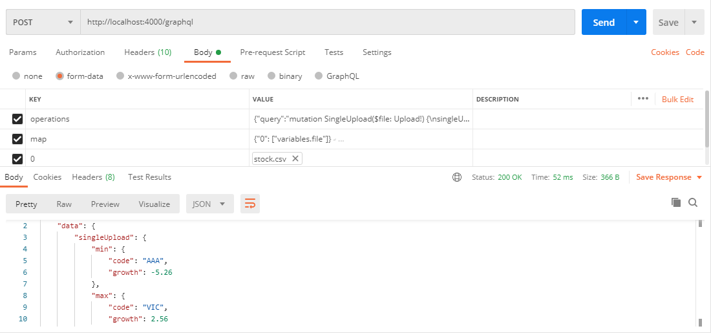

# Back-end Engineer - Technical Challenge
# Problem
Write a simple web server that performs the following tasks: a **GraphQL API** that takes a CSV file as an input and returns the following:
 * The stock code that has the biggest growth rate
 *  The stock code that has the smallest growth rate
## Installation
Before installing, [download and install Node.js](https://nodejs.org/en/download/).
Node.js 10.0 or higher is required.

Installation is done using the
[`npm install` command](https://docs.npmjs.com/getting-started/installing-npm-packages-locally):

```console
$ npm install 
```

## Build 
```console
$ npm run build
```

## Run in dev mode 
```console
$ npm run dev
```
  URL endpoint: http://localhost:4000/graphql
## Run in production mode
```console
$ npm run start
```
  URL endpoint: http://localhost:4000/graphql
## Test
```console
$ npm run test
```

### Test in PostMan
**CURL**
```console
curl --location --request POST 'http://localhost:4000/graphql' \
--header 'x-apollo-operation-name: multipart/form-data' \
--form 'operations={\"query\":\"mutation SingleUpload($file: Upload!) {\\nsingleUpload(file:$file ){\\nmin{\\ncode\\ngrowth\\n}\\nmax {\\ncode\\ngrowth\\n}\\n}\\n}\"}' \
--form 'map={\"0\": [\"variables.file\"]}
' \
--form '0=@"/D:/study/stock/stock/test/stock.csv"'
```



